# PipelinePulse

Multi-tenant monitoring + alerting dashboard for Apache Airflow. Sign up, connect your Airflow, and get a private single pane of glass for run history, task-level errors, SLAs, alerts, and AI-assisted failure analysis. Self-host or deploy to Render in one click.

[](https://render.com/deploy?repo=https://github.com/kunalt07/pipelinepulse)

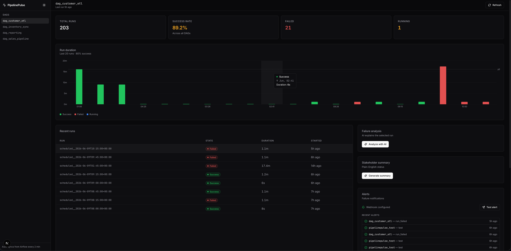

> ⚠️ **What this is.** PipelinePulse only talks to Apache Airflow. It does not connect to Jenkins, Spinnaker, GitHub Actions, Dagster, or other CI/CD platforms. Your DAGs continue to live in your Airflow; PipelinePulse just observes and surfaces them.

## Why

Airflow's native UI is great for *operating* DAGs. It's not great for *monitoring* them: no alerts on failure, no quick way to see which task broke in a 50-task DAG, no SLA tracking, no friendly summaries to share with stakeholders. PipelinePulse fills that gap.

Each PipelinePulse account is its own private tenant — your envs, runs, alerts, reports, and API tokens are isolated from every other user on the same instance. New users sign up to an empty dashboard and walk through a guided setup to connect their first Airflow.

## Features

### Monitoring
- **Multi-environment** — connect to multiple Airflow instances at once (prod, staging, …) and switch between them from the sidebar. Each environment has fully independent run history, alerts, and configs.
- **Run history & duration chart** — last 50 runs per DAG, color-coded by state, with a p95 reference line for spotting anomalies.
- **Task drill-down** — click any run to see its tasks, their states, and the actual error captured from logs.
- **Live log viewer** — fetch full task logs on demand from Airflow.
- **Health strip** — at-a-glance 24h status bars for every DAG, scannable in seconds.
- **Sidebar DAG filter** — substring match across pinned + all DAGs, `/` to focus, Esc to clear.

### Alerts & SLAs
- **Webhook alerts** — fire a notification to Slack / Discord / Mattermost / Google Chat / any JSON-accepting webhook on the *first* time a run transitions to `failed`. Deduplicated per run, never spammy.
- **Per-DAG alert config** — mute, threshold (only alert after N consecutive failures), quiet hours with timezone awareness.
- **SLA tracking** — daily wall-clock deadlines (e.g. "morning report must finish by 09:00 UTC") and per-run max-runtime caps. Breaches fire dedicated webhooks; an at-risk banner warns when a deadline is approaching with no successful run yet.
- **Stuck-run detection** — flags currently-running DAGs whose elapsed time exceeds 2× p95 of past successes.

### AI (optional)
- **Failure analysis** — Gemini reads the failed task's logs and explains the root cause in plain English + suggests fixes.
- **Stakeholder summaries** — generate non-technical "is the pipeline okay?" status messages.
- **Period narratives** — Gemini writes a 3-4 sentence summary of the period for inclusion in reports.

### Reports
- **Shareable snapshots** — generate Markdown / HTML / PDF reports of the last 7 or 30 days. Includes executive summary with prior-period deltas, per-DAG breakdown with p95s, top failures with error excerpts, SLA compliance, and an optional AI narrative.
- **Scheduled delivery** — configure weekly or monthly auto-generation; PipelinePulse fires a webhook with a link back to the report (the file itself stays in the app, sidesteps Slack/Discord file-upload limits).
- **History** — every generated report is preserved and can be re-rendered in any format on demand.

### Workflow
- **Run annotations** — pin a note to any run (known issues, JIRA links, repro steps). Notes appear as badges in the runs table and flow into report top-failure sections.
- **Run-vs-run diff** — pick any two runs (same DAG or cross-DAG) and see task-level state + duration deltas. Defaults to current vs. last success for failed runs.
- **Re-trigger run** — kick a fresh DAG run from the dashboard.
- **Force re-sync** — pull a stale run from Airflow if its state changed after the periodic sync window.

### Auth & accounts
- **Multi-tenant accounts** — email/password signup, server-side sessions (HttpOnly cookies, sliding 30-day expiry, hard-capped at 60). Each user is their own tenant: envs, runs, alerts, reports, and tokens are fully isolated. The first user signed up on a fresh instance becomes admin.
- **First-run wizard** — new users land on a guided 5-step setup (welcome → connect Airflow → optional webhook → optional AI key → done). Triggers automatically when `envCount === 0` for the user.
- **Per-user sync** — each user's Airflow connections poll on their own schedule (configurable via Settings → Sync). Sync jobs are registered on signup, rescheduled live when interval changes.
- **API tokens** — personal access tokens for curl/scripts. Sent as `Authorization: Bearer pp_…`. List, revoke, and view last-used time from Settings.
- **Rate limiting** — `slowapi` per-IP limits on `/auth/login` (5/min) and `/auth/signup` (3/hour) blunt brute-force attempts.

### Settings
- **Runtime overrides** — change the webhook URL, Gemini key/model, sync interval, and stuck-run thresholds from the UI without restarting the backend.
- **Danger zone** — reset alert configs, clear notifications, clear report history, force full Airflow re-sync.
- **Theme toggle** — light/dark, defaults to dark.

All optional features degrade gracefully — if you don't set the relevant env var, the feature simply turns off and the rest of the dashboard keeps working.

## Tech stack

| Layer | Technology |
|---|---|
| Orchestration | Apache Airflow 2.x (any 2.x with REST API + `basic_auth` backend) |
| Backend | FastAPI + Python 3.11 + APScheduler + SQLAlchemy |
| Database | PostgreSQL 15 |
| AI | Google Gemini API (optional) |
| Frontend | Next.js 15 + Tailwind + Recharts + framer-motion |
| Reports | Jinja2 + WeasyPrint |
| Auth | bcrypt (passlib) + server-side sessions + Bearer tokens |
| Infrastructure | Docker Compose |

## Deploy to Render (cloud, no setup)

The fastest way to try PipelinePulse against your existing Airflow:

1. Click the **Deploy to Render** button above. It provisions Postgres + backend + frontend on Render's free tier (~3 min).
2. Once it's up, open the frontend URL (e.g. `https://pipelinepulse-frontend.onrender.com`) and sign up.
3. Settings → Environments → Add environment → enter your Airflow's URL + credentials → Test → Save.

The Render blueprint deploys *only* PipelinePulse — bring your own Airflow (MWAA, Composer, Astronomer Cloud, or any reachable Airflow 2.x instance with the REST API enabled).

## Quickstart (Docker — recommended)

Brings up Airflow, the backend, and the dashboard with one command. Includes 4 sample DAGs that simulate stable + failing pipelines, so you can see the tool in action without pointing it at a real Airflow.

```bash
git clone https://github.com/kunalt07/pipelinepulse.git
cd pipelinepulse

# 1. Configure (most defaults are fine for a local demo)
cp .env.example .env
# Optional, but worth setting before first boot:
#   AUTH_USER + AUTH_PASS  — seeds the first admin account on first boot.
#                            After that you manage users via /signup.
#   GEMINI_API_KEY         — enables AI features
#                            (https://aistudio.google.com/apikey)
#   WEBHOOK_URL            — enables Slack/Discord/etc. alerts

# 2. Initialize Airflow (one-time)
docker compose up airflow-init

# 3. Bring everything up
docker compose up -d
```

| Service | URL | First steps |
|---|---|---|
| Dashboard | http://localhost:3000 | Sign up (or log in with your `AUTH_USER`/`AUTH_PASS`) |
| Backend API | http://localhost:8000/docs | Swagger UI for the REST API |
| Airflow UI | http://localhost:8080 | `admin` / `admin` |

Give it ~5 minutes for sample DAGs to produce runs.

## Point at your own Airflow

Two ways:

**Option A — via the UI (recommended).** Sign in, go to Settings → Environments → Add environment, fill in your Airflow's URL + credentials, click Test, save. The sidebar gets an environment switcher; you can keep the demo Airflow alongside or remove it.

**Option B — via env vars on first boot.** Set `AIRFLOW_BASE_URL` / `AIRFLOW_USERNAME` / `AIRFLOW_PASSWORD` in `.env` *before* the first `docker compose up`. They seed the default environment. After first boot they're not consulted again — change connection details via the UI.

```bash
AIRFLOW_BASE_URL=https://your-airflow.example.com
AIRFLOW_USERNAME=your-user
AIRFLOW_PASSWORD=your-password
```

If you only want PipelinePulse and you already have Airflow + Postgres elsewhere:

```bash
docker compose up -d postgres backend frontend
```

Your Airflow needs the REST API enabled with `basic_auth` (this is the Airflow 2.x default for most setups).

## Configuration reference

All variables go in `.env`. Most settings can also be edited from Settings in the UI after first boot — env vars are the bootstrap path, the database is the source of truth at runtime.

| Variable | Required | Purpose |
|---|---|---|
| `DATABASE_URL` | yes | Postgres connection string for PipelinePulse's tables |
| `AIRFLOW_BASE_URL` | first boot only | Seeds the default environment's Airflow URL. Edit later via Settings → Environments. |
| `AIRFLOW_USERNAME`, `AIRFLOW_PASSWORD` | first boot only | Seeds the default environment's credentials |
| `AIRFLOW_PUBLIC_URL` | no | Public Airflow URL for alert deep-links (defaults to `AIRFLOW_BASE_URL`) |
| `AUTH_USER`, `AUTH_PASS` | first boot only | Both seed the first admin user. Email becomes `<AUTH_USER>@local`. After first signup these vars are inert. |
| `COOKIE_SECURE` | no | Set to `true` behind HTTPS to add the Secure flag to the session cookie |
| `PUBLIC_BASE_URL` | no | Public URL of this PipelinePulse instance, used in scheduled-report webhook payloads |
| `GEMINI_API_KEY` | no | Enables AI features (failure analysis, stakeholder summaries, report narratives) |
| `GEMINI_MODEL` | no | Defaults to `gemini-flash-lite-latest` (free-tier friendly) |
| `WEBHOOK_URL` | no | Slack-compatible incoming webhook for failure / SLA / report alerts |
| `CORS_ORIGINS` | no | Comma-separated origins allowed to call the backend (default: `http://localhost:3000`) |

### Setting up alerts

- **Slack:** [create an incoming webhook](https://api.slack.com/messaging/webhooks), copy the URL, paste it into Settings → Integrations → Webhook URL.
- **Discord:** Channel settings → Integrations → Webhooks → New Webhook → copy URL, then **append `/slack` to the URL** (Discord supports Slack-format payloads at that suffix). Paste into Settings.
- **Mattermost / Google Chat / generic:** any URL that accepts a `{"text": "..."}` JSON POST will work.

After saving, hit **Test alert** in the dashboard's Alerts card to confirm delivery.

### Using the API from scripts

Once you've signed in via the UI:
1. Settings → API tokens → Create token → copy the `pp_…` value (shown once).
2. Use it as `Authorization: Bearer pp_…` from curl/scripts.

```bash
curl -H "Authorization: Bearer pp_a1b2..." http://localhost:8000/summary?env=prod
```

Tokens are revocable from the same Settings card.

## Run without Docker

```bash
# Backend
cd backend
python -m venv venv && source venv/bin/activate
pip install -r requirements.txt
cp .env.example .env  # fill in values
uvicorn main:app --reload --port 8000

# Frontend (in a second terminal)
cd frontend
npm install
npm run dev
```

The frontend reads `NEXT_PUBLIC_API_URL` (default `http://localhost:8000`).

## Project structure

```
pipelinepulse/
├── docker-compose.yml          # Full stack: Airflow + Postgres + backend + frontend
├── .env.example                # All configurable env vars documented here
├── dags/                       # Sample DAGs (stable + various failure modes)
├── backend/
│   ├── Dockerfile
│   ├── main.py                 # FastAPI routes
│   ├── auth.py                 # Sessions, password hashing, API tokens, current_user
│   ├── scheduler.py            # Per-env Airflow polling, alerts, SLA checks, scheduled reports
│   ├── airflow_client.py       # Airflow REST API client (parameterised by environment)
│   ├── notifier.py             # Webhook delivery (failure / SLA / report)
│   ├── reports.py              # Report aggregation + Markdown/HTML/PDF rendering
│   ├── sla.py                  # SLA evaluator (deadline + max-runtime breaches)
│   ├── settings.py             # Runtime-overridable settings with TTL cache
│   ├── environment.py          # Multi-env resolver + FastAPI dependency
│   ├── database.py             # Postgres connection + idempotent migrations
│   ├── models.py               # All SQLAlchemy models
│   ├── templates/report.html.j2  # Jinja2 template for HTML/PDF reports
│   └── requirements.txt
└── frontend/
    ├── Dockerfile
    ├── package.json
    └── src/
        ├── app/                # Next.js app router (login, signup, dashboard)
        ├── components/         # Dashboard, sidebar, settings, reports, env switcher, etc.
        └── lib/                # API client, utilities
```

## Screenshots

### Multi-environment dashboard

Run history, duration chart, SLA at-risk banner, stuck-run banner, 24h health strip, and metric tiles — all scoped to the active environment via the sidebar switcher.

| Dark mode | Light mode |
|---|---|
|  | 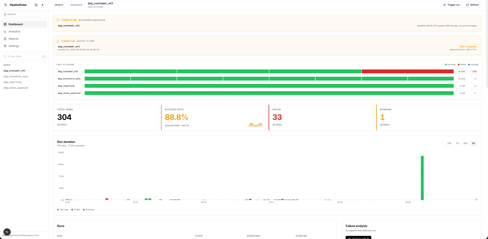 |

### Failure analysis

| Captured task error | AI explanation |
|---|---|
| 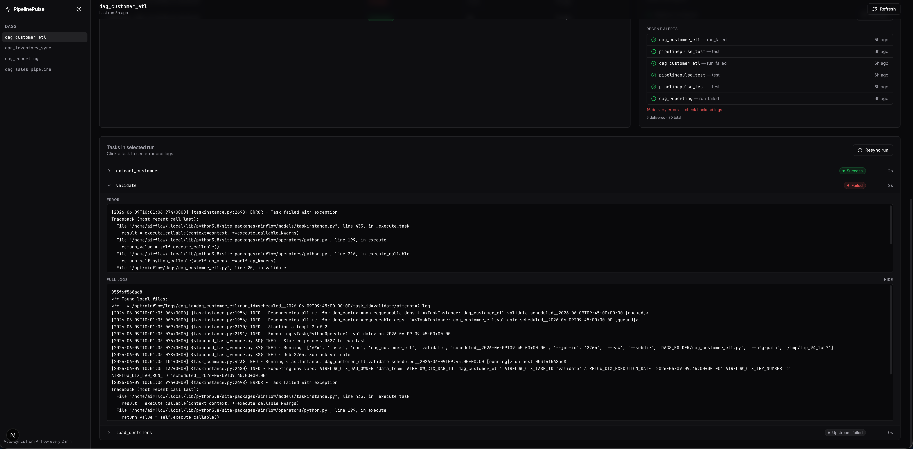 | 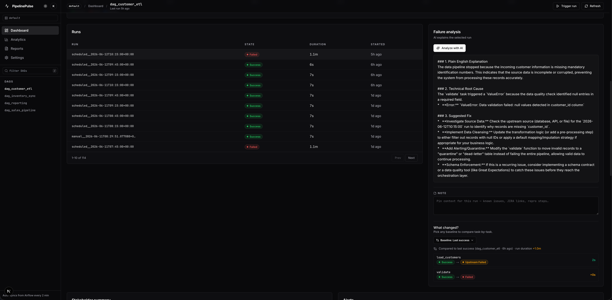 |
| The failed task's error is extracted from logs at sync time. | Optional Gemini-powered root cause + suggested fix. |

### Webhook alerts

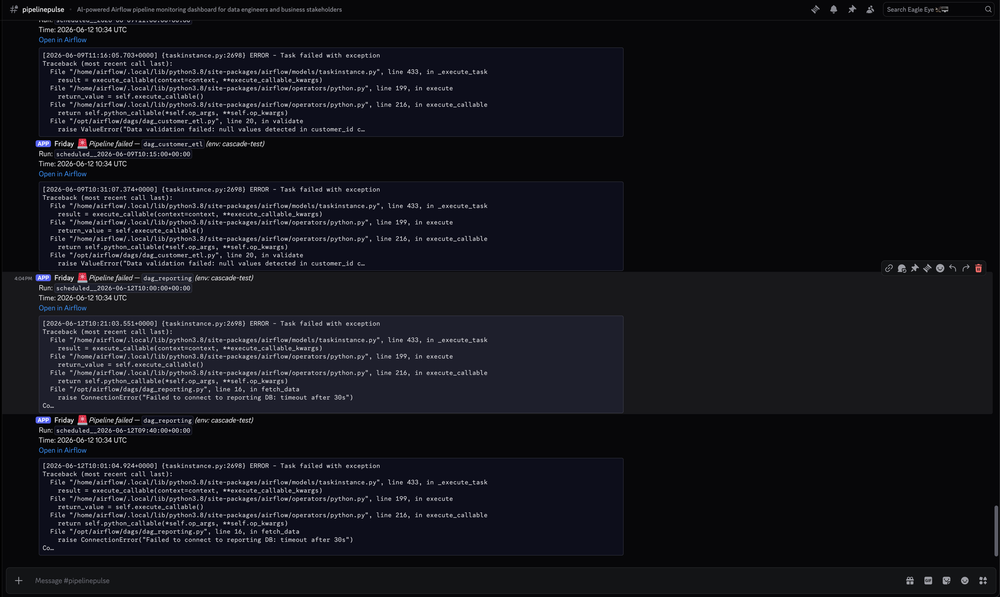

Slack-format payload, dedup'd per run, with deep-link back to Airflow.

### Analytics

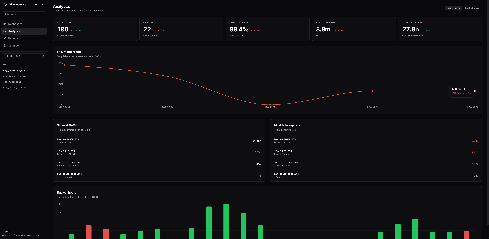

Cross-DAG aggregates with 7d/30d toggle, prior-period deltas, slowest + most-failure-prone rankings, and busy-hours histogram.

### Reports

| In-app generation + history | Generated HTML report |
|---|---|
| 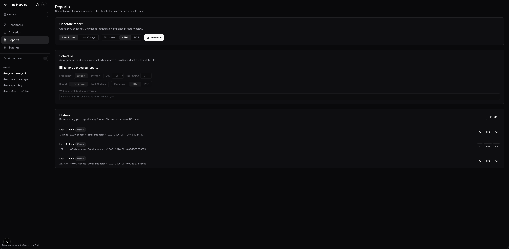 | 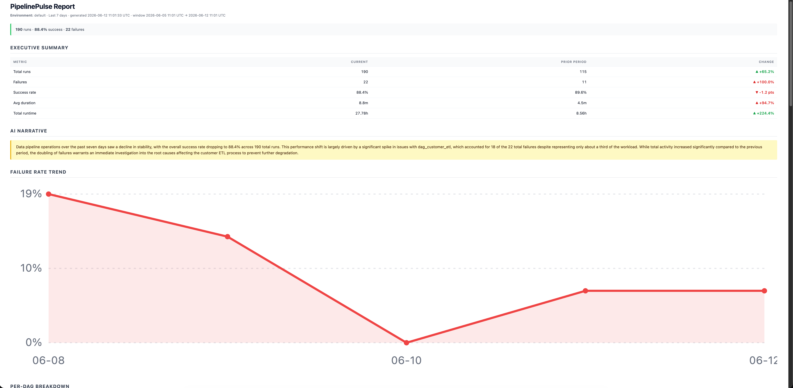 |
| Markdown / HTML / PDF, on-demand or scheduled. | Self-contained HTML — paste into email, open from disk, or save. |

### SLA tracking

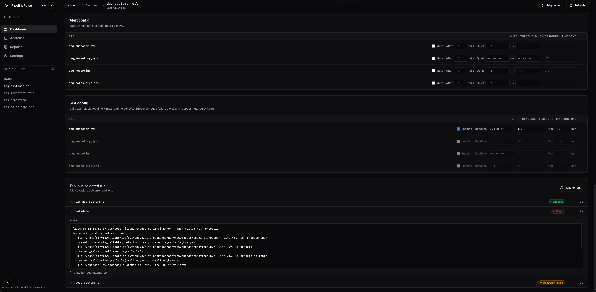

Per-DAG daily wall-clock deadline + max runtime caps. Breaches fire dedicated webhooks.

### Run-vs-run diff

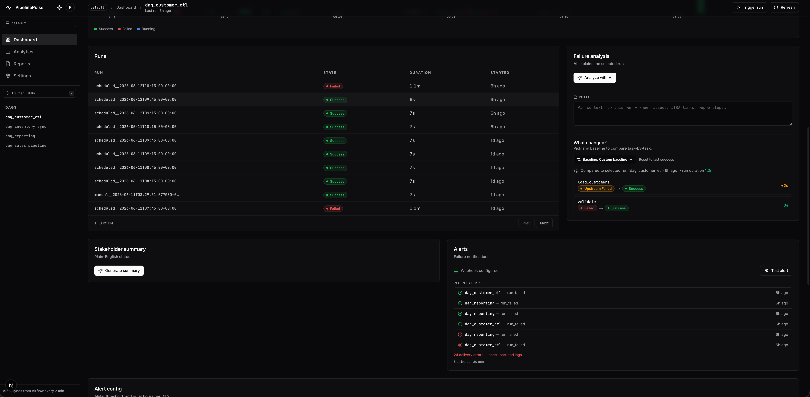

Compare any two runs (same DAG or cross-DAG) and see task-level state + duration deltas.

### Settings

| Integrations + Sync + Stuck-run | Environments + API tokens + theme + danger zone |
|---|---|
| 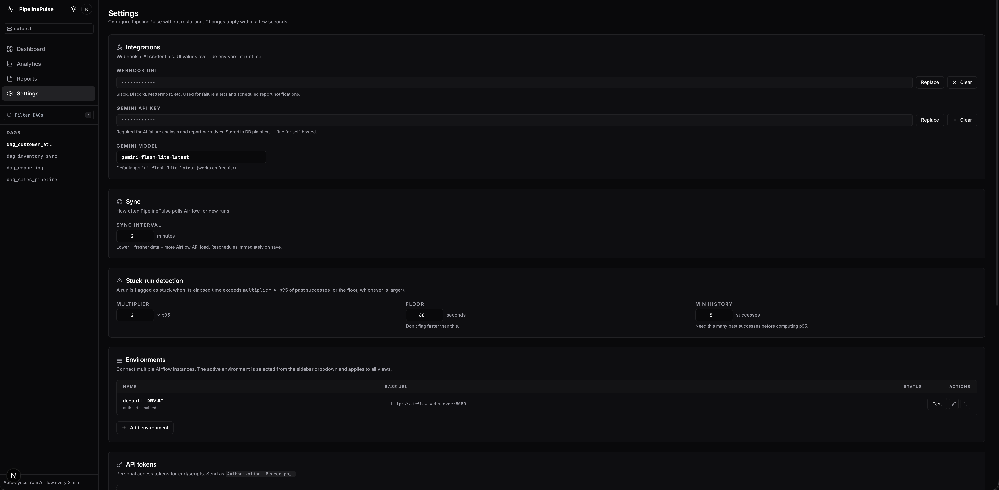 | 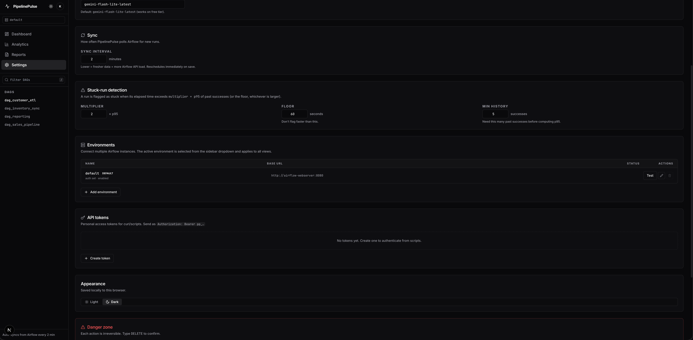 |
| Webhook URL, Gemini key, sync interval, stuck-run thresholds — all editable at runtime. | Manage Airflow connections, mint API tokens for scripts, theme, and irreversible "danger zone" actions. |

## Architecture

The backend polls each enabled environment's Airflow REST API on an interval (default 2 min, editable via Settings). Runs and tasks are upserted into Postgres, scoped by `environment_id`. When a run transitions into `failed`, the backend captures an error excerpt from logs, fires the configured webhook (with dedup so it's only sent once per run), and records the notification.

Three APScheduler jobs run continuously:
- **Sync** (every N min) — pulls latest 50 runs per DAG per environment.
- **SLA breach check** (every 2 min) — scans recently-completed runs for deadline/runtime breaches.
- **Scheduled reports** (every 15 min) — checks each environment's report schedule and generates if due.

The frontend never talks to Airflow directly; it reads from the backend. Auth is session-cookie-based for the web UI and `Authorization: Bearer` for scripts.

## Changelog

See [CHANGELOG.md](CHANGELOG.md) for a human-readable summary of every release. `git log` has the full detail.

## Contributing

Issues and PRs welcome — see [CONTRIBUTING.md](CONTRIBUTING.md). For larger changes, please open an issue first to discuss.

## License

[MIT](LICENSE) — use it however you want.
